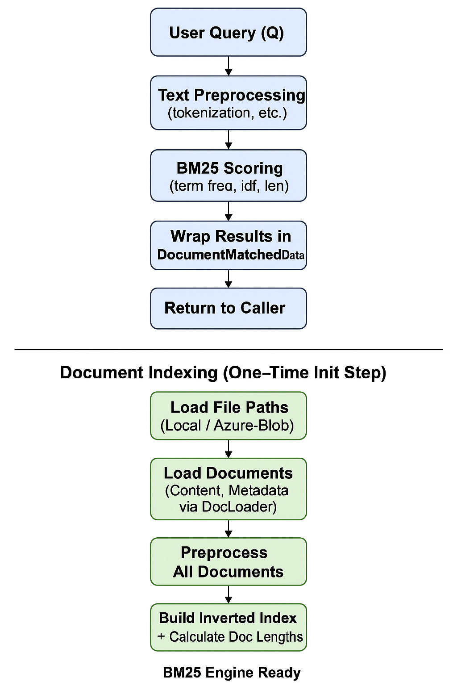
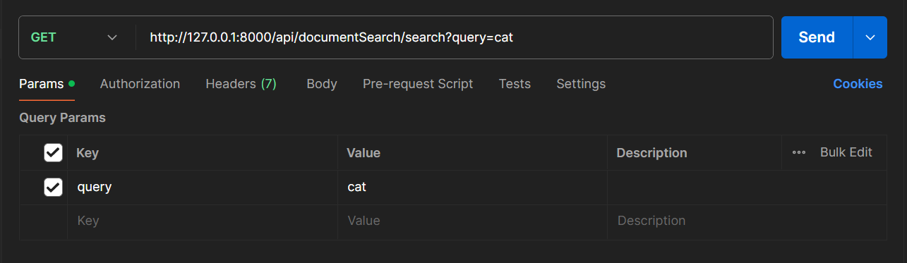

# 📄 Document Search API

The **Document Search API** allows you to perform intelligent and efficient search across a collection of documents using **natural language queries**. It leverages modern NLP techniques to return the most relevant results, making document retrieval smarter and more intuitive.

---

## 🚀 Features

- 🔍 Natural language search across multiple documents  
- 📁 Search endpoint to retrieve top-matching documents  
- ⚡ Fast, lightweight API powered by FastAPI and Uvicorn  

---

## Diagram



## 📦 Installation & Setup

Follow these steps to set up and run the API locally:

### 1. Clone the Repository

```
git clone https://github.com/mohdsaqibhbi/Document_Search.git
cd Document_Search
```

### 2. Create and Activate a Conda Environment

```
conda create -n <env_name> python=3.11 -y
conda activate <env_name>
```

### 3. Install Dependencies
```
pip install -r requirements.txt
```

### 4. Setup the config file `config.json`
```
{
    "documents": {
        "location": "../../data/documents",
        "doc_type": [".txt", ".csv", ".pdf", ".png"],
        "location_type": "local"
    },
    "bm25": {
        "k": 1.2,
        "b": 0.75,
        "delta": 0.5
    },
    "text_preprocessor": {
        "pattern": "[^a-z0-9\\s]"
    }
}
```

### 5. Create and Setup Cloud (Azure) environment config `env_config.json` [Optional]
```
{
    "connection_string": "your-azure-blob-storage-connection-string",
    "container_name": "your-azure-container-name"
}
```
Also, change the **location_type** from **_local_** to **_azure_** in `config.json`

### 6. Start the API
```
uvicorn api:app
```

## 🔌 API Endpoints

### `/search`

- **Method:** `GET`
- **Description:** Returns the list of documents that best match the given natural language query.
- **Query Parameter:**
  - `query` (str): The search term or phrase.

### `/health`

- **Method:** `GET`
- **Description:** Simple health check endpoint to verify that the API is running.

## 🔗 Usage

You can test the search endpoint by sending a GET request using:

### Postman


### Browser
Put this into the brower and hit **Enter**.
```
http://127.0.0.1:8000/api/documentSearch/search?query=cat
```

### curl
```
curl -X GET "http://127.0.0.1:8000/api/documentSearch/search?query=cat"
```